# Referencia teo útil

### paginación

#### Page fault kernel exception siendo bueno (swappeo)

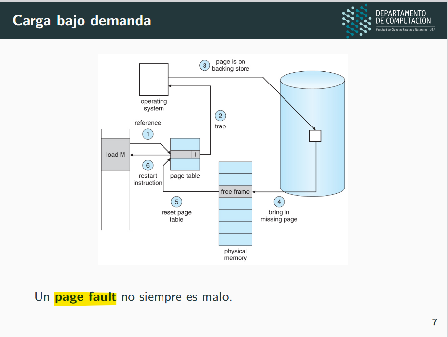

- a veces queremos mantener el error para manejar los casos de swappeo!

#### Datos tamaños tablas

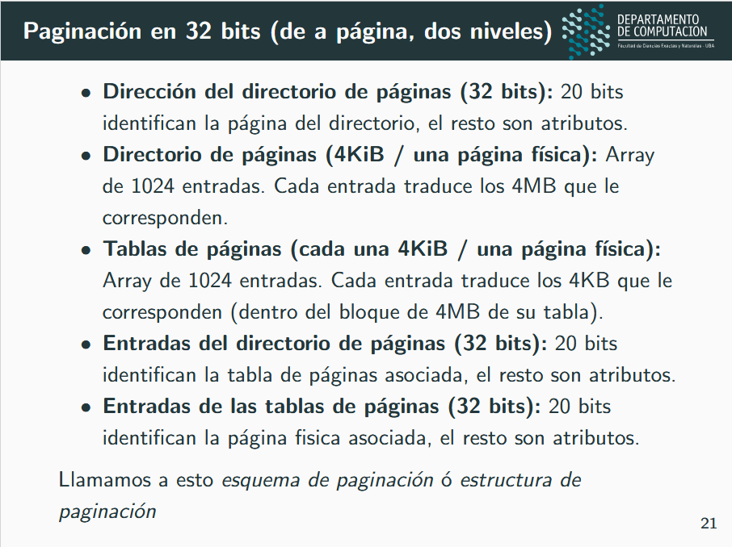

#### Camino de traducción de mmu

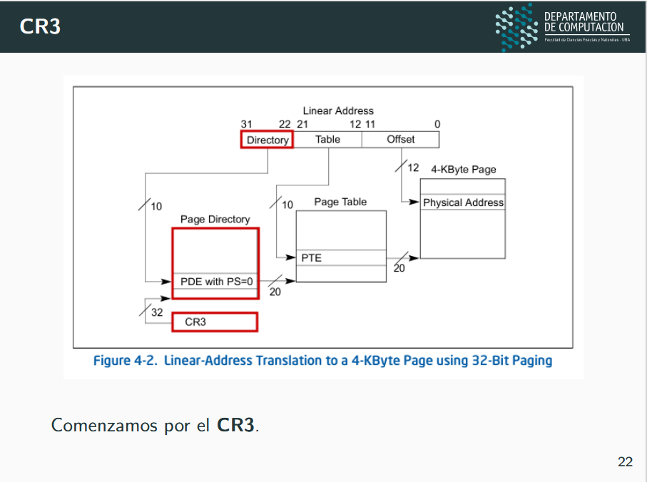


### cr3, dirs y entradas de tablas

#### cr3

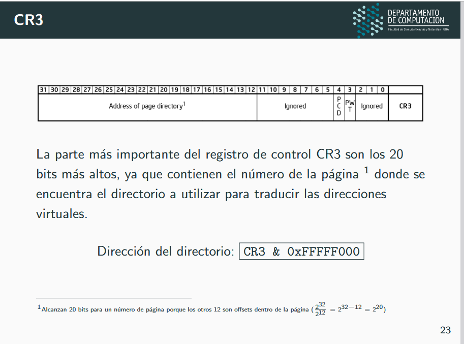

#### pde

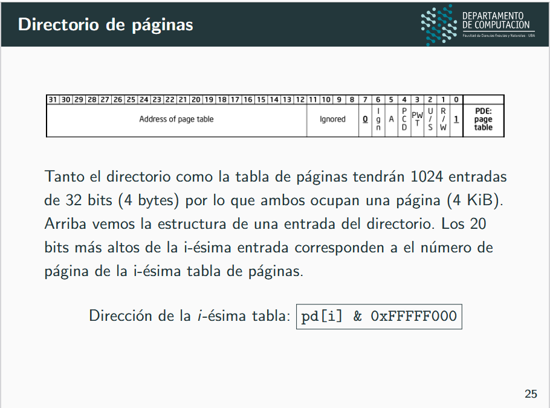

#### pte

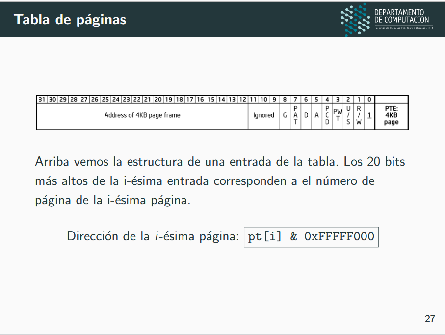

### TLB

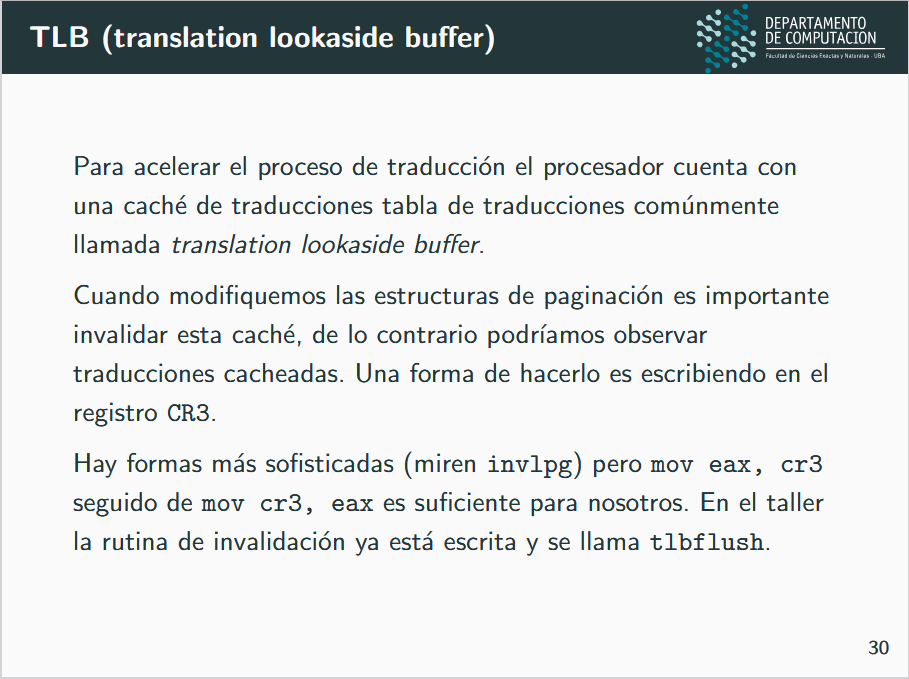

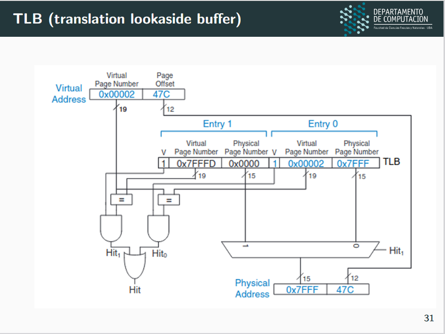

### TSS y TR

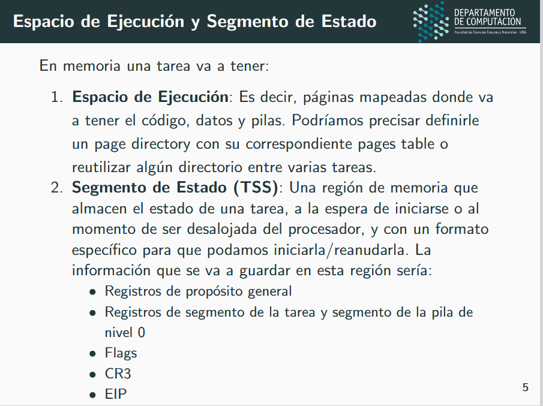

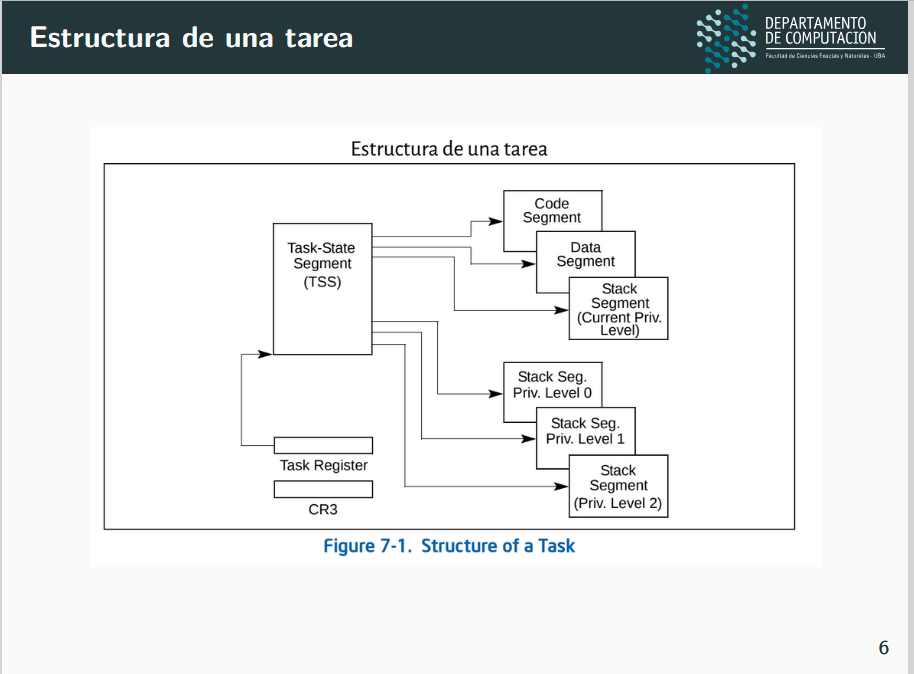

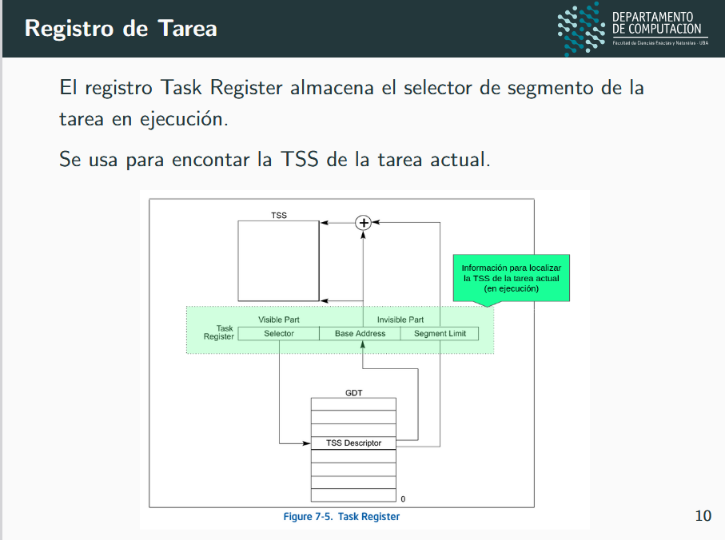

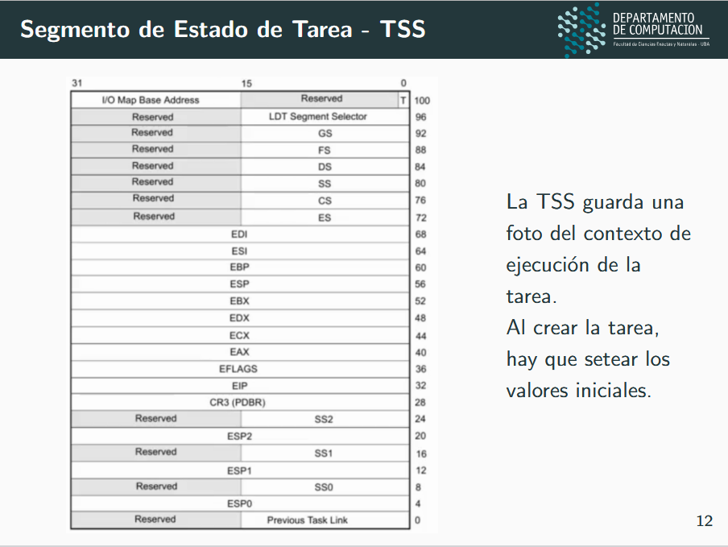

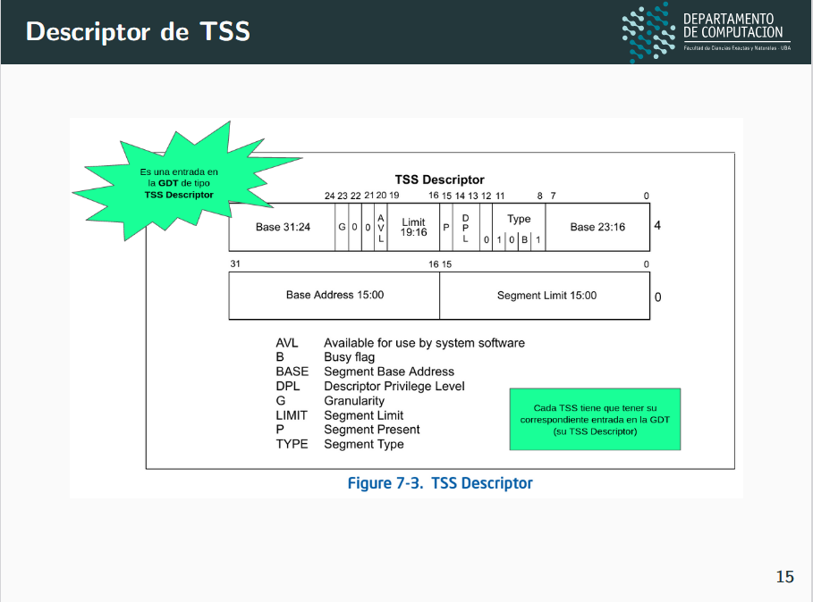

### Context Switch

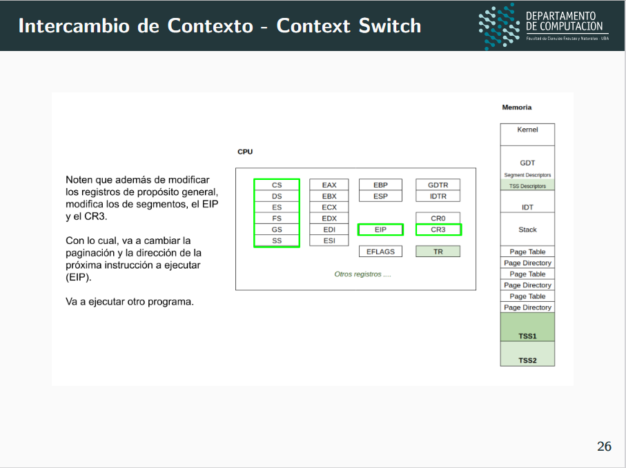

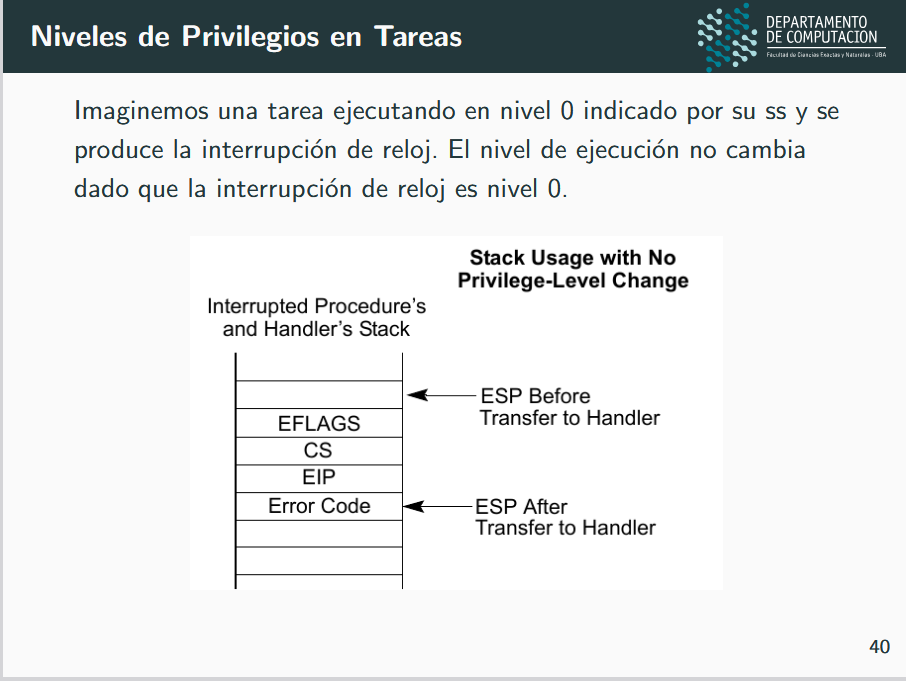

- ``SS0`` == ``SS``
- ``ESP0`` == ``ESP``

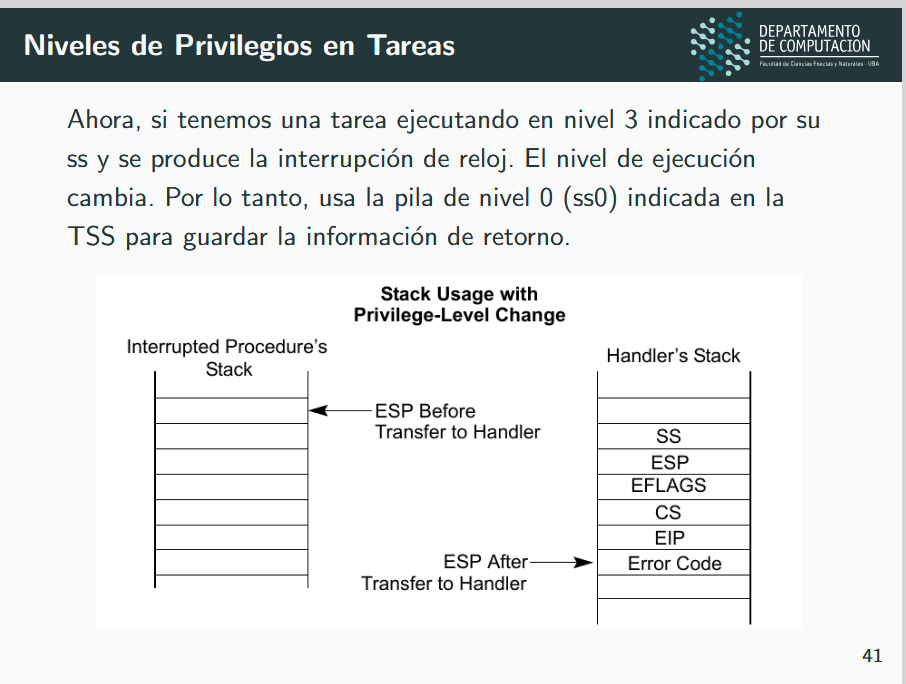

- SE CAMBIAN
    - SS <- SS0
    - ESP <- ESP0
- Y SE GUARDAN LOS VALORES DE LOS MISMOS, ENTRE OTRAS COSAS


# Ref TP: Pasaje a Modo Protegido

## Intro


- En el taller usaremos segmentación ***flat***, que casi anula por completo el efecto de la unidad de segmentación

- Como no es posible en x86 anular la unidad de segmentación. Tenemos que definir los segmentos de alguna manera:
    - ``GDT_CODE_0_SEL``
    - ``GDT_DATA_0_SEL``
    - ``GDT_CODE_3_SEL``
    - ``GDT_DATA_3_SEL``

## Archivos provistos

-   `Makefile` - encargado de compilar y generar la imagen del floppy disk.
-   `diskette.img.bz2` - la imagen del floppy que contiene el boot-sector preparado para cargar el kernel.
-   `kernel.asm` - esquema básico del código para el kernel.
-   `defines.h, colors.h` - constantes y definiciones.
-   `gdt.h, gdt.c` - definición de la tabla de descriptores globales.
-   `screen.h, screen.c` - rutinas para pintar la pantalla.
-   `a20.asm` - rutinas para habilitar y deshabilitar A20.
-   `print.mac` - macros útiles para imprimir por pantalla y transformar valores.
-   `kassert.h` - rutinas para garantizar invariantes en el kernel.
-   `i386.h` - funciones auxiliares para utilizar assembly desde C.
-   `types.h` - declaración de tipos comunes en el kernel.

## Cambios

En esta parte se cambiaron los archivos
- `kernel.asm`
- `defines.h`
- `screen.c`
- `gdt.c`

## Ejercicios

### Repaso:

- El procesador arranca en modo real (16 bits)
- Nuestro programa tiene que completar la información mínima necesaria requerida por la documentación de Intel para poder pasar el procesador a modo protegido de 32 bits.

- El modelo de memoria segmentada no suele utilizarse en los sistemas operativos modernos
- Intel no permite "apagar" la segmentación, pero sí es posible usar un modelo donde la segmentación es limitada al mínimo
    - Por esta razón, vamos a seguir el modelo "**Basic Flat Model**" (ref: Manual de Intel - **Volumen 3 - 3.2.1 Basic Flat Model.**)

### Primera parte: Definiendo la GDT

1. **Volumen 3: System Programming. Sección 2.2 Modes of Operation**:

- `modo real`
    - Este modo provee el entorno del procesador Intel 8086
    - se trabaja en 16 bits
    - se puede direccionar hasta 1 MB de memoria, los modos de direccionamiento son mas limitados que en modo protegido
    - tiene rutinas de atencion de interrupciones
    - no hay protección de memoria ni niveles de privilegio.

Expandiendo un poco:

- **Límite de memoria:** ``1 MB`` ($2^{20}$ bytes)
- **Mecanismo:** Se utiliza un ``modelo de direccionamiento segmentado``
- **Cálculo de la dirección:** Se combinan una dirección de segmento (un valor de 16 bits) y un desplazamiento (también de 16 bits) para formar una dirección física de 20 bits.
- **Fórmula:** La dirección física se calcula aumentando un cero al valor del segmento y sumando el desplazamiento:
    - Dirección_Física = $(Segmento << 4) + Desplazamiento$

- **Características:** El modo real no incluye protección de memoria ni multitarea a nivel de hardware. 

- `modo protegido`
    - Es el modo nativo del procesador
    - Tiene 4Gb de memoria disponible
    - tiene 4 niveles de protección
    - tiene rutinas de atencion de interrupciones con privilegios
    - el set de instrucciones depende del nivel de privilegio. 

2. Por que hacer el pasaje a modo protegido?
    - Tendriamos mas memoria disponible
    - habria niveles de protección para que el usuario no acceda a cualquier tarea
    - se deja de trabajr en 16 bits, es decir, depende en que estes arquitectura utilizas: 32 o 64 bits.

3. **volumen 3 de Intel en la sección 3.4.5 Segment Descriptors**
- GDT
- descriptor de segmento bit a bit
- Expliquen brevemente para qué sirven los campos *Limit*, *Base*, *G*, *P*, *DPL*, *S*

- La gdt (Global Descriptor Table):
    - es una tabla que almacena los descriptores de segmento que se utilizar para calcular la dirección lineal. El formato de un descriptor de segmento es el siguiente:
      -    Primeros 4 bytes:
            00 al 15: Limite
            16 al 31: Primeros 16 bits de la base
      -    Segundos 4 bytes:
            0 al 7: Siguientes 8 bits de la base
            8 al 11: type
            12: S
            13 al 14: DPL
            15: P
            16 al 19: Siguientes 4 bits del limite
            20: AVL
            21: L
            22: D/B
            23: G
            24 al 31: Últimos bits de la base

    - Límit: Es el máximo offset que puede tener un byte direccionable dentro del segmento
    - Base: Define la ubicación del byte 0 del segmento dentro de los 4 GB del espacio de direcciones lineal
    - G: Determina cómo se interpreta el límite del segmento. Si la granularidad es 0, el límite se interpreta como bytes. Si es 1, se interpreta como 4 KB.
    - P: Especifica si el segmento está presente en memoria. Si no lo está y un selector de segmento apunta a este descriptor, salta la excepción de segmento no presente.
    - DPL: Especifica el nivel de privilegio. Siendo 00 el más alto, y 11 el más bajo.
    - S: Especifica si el segmento es de sistema o si es de código/datos.

4. **Tabla de la sección 3.4.5.1 Code- and Data-Segment Descriptor Types del volumen 3 del manual del Intel** nos permite completar el *Type*

- En type field tenemos
    - bit 11: define si es de datos o código, así que queremos que sea 1
    - bit 10: define si es conforming, como no especifíca la pregunta lo seteamos en 0
    - bit 9: define si se puede leer además de ejecutar. Lo seteamos en 1
    - bit 8: determina si está "accessed". Como no lo pide la pregunta, lo seteamos en 0.

    - La combinacion de bits seria: ``1010``
        - $b_{11}$ = 1
        - $b_{10}$ = 0
        - $b_{9}$ = 1
        - $b_{8}$ = 0


Hay dos tipos de tablas que describen segmentos a nivel global y local (GDT y LDT):
- La tabla **LDT** no se utiliza en el modelo de segmentación *flat* que estaremos utilizando
- Para este taller sólo vamos a usar la Tabla de Descriptores Global (**GDT**)

5. Inicialmente, vamos a definir los siguientes segmentos en la GDT:

    a.  Un segmento para **código de nivel 0 ejecución/lectura**
    b.  Un segmento para **código de nivel 3 ejecución/lectura**
    c.  Un segmento para **datos de nivel 0 lectura/escritura**
    d.  Un segmento para **datos de nivel 3 lectura/escritura**

- Cada uno de estos segmentos **deben direccionar los primeros 817 MiB**[^1] de memoria y por estar usando segmentación **flat**, van a estar solapados.
- Los campos de cada descriptor de cada uno de los segmentos están en la tabla del tp.

(Noten que si bien definimos distintos niveles de privilegio, todos usan la misma región de memoria física, por lo cual, no hay una división real de permisos de accesos propuesto a nivel segmentación. Esto se arregla después)

6. ¿Qué creen que contiene la variable `extern gdt_entry_t gdt;` y `extern gdt_descriptor_t GDT_DESC;`?

    - `extern gdt_entry_t gdt;`: es **la GDT**.
    - `extern gdt_descriptor_t GDT_DESC;`: **es el valor que se carga en el gdtr**, con lgdt
        - tiene: 
            - la cantidad de entradas de nuestra gdt
            - la dirección de memoria en la que se encuentra.


7. **Volumen 3 del manual de Intel, sección 3.4.2 *Segment Selectors* tiene el formato de los selectores de segmento**. 
   - **USAR LAS MACROS**

8. (...)

9. Completen todo lo necesario en `kernel.asm` hasta "Habilitar A20" inclusive[^2]
- Las macros de impresión se encuentran definidas en `print.mac`
- Para los colores hay constantes definidas en `colors.h`. Las macros reciben sus argumentos separados por comas, sin paréntesis ni nada. Por ejemplo:

    ```print_text_rm arg1, arg2, arg3, arg4, arg5.```

    *Hint*: investiguen para qué puede servir la instrucción **cli** en el manual 2.

10. Instrucción LGDT en el **Volumen 2 del manual de Intel**. 
    - Sirve para indicar donde empieza la GDT en memoria y hasta donde llega
    - Espera un valor de 6 bytes:
        - Primeros 2 bytes indican hasta donde llega (multiplo de 8, porque cada descriptor ocupa 8 bytes)
        - Siguientes 4 bytes: indican donde empieza la tabla en la memoria.
    - En el código, la estructura que define dónde esta almacenada la GDT y su tamaño es ``GDT_DESC`` (Se inicializa en gdt.c al final del archivo).

11. Carguen la gdt

12. (...)

### Segunda parte: Pasaje a modo protegido

Para pasar a modo protegido tenemos que completar los siguientes pasos:

- Deshabilitar interrupciones
- Completar la GDT en memoria
- Cargar la dirección de la GDT en el registro del procesador GDTR
- Habilitar el modo protegido en el procesador
- Hacer un jmp far al segmento de código de nivel 0
- Cargar los selectores de segmento restantes

    Referencia: manual **volumen 3, sección 9.9.1 "Switching to Protected Mode"**. Los pasos que nos interesan ahora son: 1,2,3,4,5 y 9
    (Tengan en cuenta, que algunos de los pasos que están ahí descritos, corresponden a paginación, que no estaremos activando aún).

13. **Manual de Intel sección 2.5 Control Registers** 

- ¿Deberíamos modificar cr0 para pasar a modo protegido?
    - Si, hay que setear el bit 0 (CR0.PE) para habilitar el modo protegido.
    
    (Si queremos modificar CR0, no podemos hacerlo directamente. Sólo mediante un MOV desde/hacia los registros de control).

14. Completen la sección del `kernel.asm` en código que modifica CR0 para pasar a modo protegido

15. **Notemos que a continuación debe hacerse un jump far para posicionarse en el código de modo protegido.** (Miren el volumen 2 de Intel para ver los distintos tipos de JMPs disponibles) y piensen cuál sería el formato adecuado. ¿Qué usarían como selector de segmento?
    - Usamos el valor de ``GDT_CODE_0_SEL`` definido previamente, con offset modo_protegido.

16. Dentro del modo protegido:
- vamos a cargar los registros selectores de segmento (`DS`, `ES`, `GS`, `FS` y `SS`)
- Todos se van a iniciar en el ``segmento de datos de nivel 0``

17. Setear la pila del kernel en la dirección `0x25000`. Configuren los registros que indican dónde está la base y el tope de la pila.

18. (mensaje bienvenida)

### INICIAR EL KERNEL

```
make gdb
```

(info para iniciar la sesión de qemu con el kernel y con gdb ya *attacheado.*)

19. (comando `info registers` para confirmar que todo haya quedado bien config.)

20. Pueden ejecutar además `info gdt` dentro de gdb para verificar que la gdt se encuentra bien cargada.

### Tercera parte: Configurando la pantalla

Pantalla:
- Se accede por un mapeo a memoria.
- La dirección física donde va a comenzar el buffer de la pantalla es `0x000B8000.`
- Va a ser un arreglo de **50 filas x 80 columnas**
    - En c/ pos del arreglo: 2 bytes que representan a una celda de la pantalla
    - Los colores y atributos se configuran acorde a una convención: [http://wiki.osdev.org/Text_UI](http://wiki.osdev.org/Text_UI)

21. (declaramos segmento screen para kernel)
- El tipo de este segmento debe ser de **datos de r/w**

22. Método `screen_draw_box` en `screen.c` y estructura `ca` en `screen.h`

``screen_draw_box``:
- recibe:
    - las dimensiones de un rectangulo
    - un caracter
    - un atributo
- escribe en ese rectangulo con el caracter y el atributo pasados
- Para hacer eso se ayuda del struct ``ca``
- Accede a la pantalla a traves de la direccion física `0x000B8000`.

23. (escribimos `screen_draw_layout` que se encargue de limpiar la pantalla y escribir lo que deseen)

### Sobre el A20

#### Resumen:

La línea A20 viene deshabilitada (aunque algunos BIOS la habilitan al iniciar) y debe chequearse su estado y habilitarla con una rutina especial.**

#### Detalles:

Dentro del código del kernel.asm, les damos una sección que habla sobre el A20. No nos queremos detener mucho aquí, porque el aporte conceptual no es relevante. Es una curiosidad técnica que necesita ser tenida en cuenta en el proceso de bootloading, nada más.

¿Qué es el A20?                                                      

- Básicamente, es el bit 21 del bus de address de un procesador 8086.
- Cuando el procesador arranca, esta línea se puede encontrar deshabilitada, lo cual impide que direccionemos correctamente rangos de memoria superiores a 1MiB.                                        
                                                                     
- ¿Por qué se encuentra deshabilitada en primer lugar?                 
                                                                     
- Recuerden que el 8086, podía direccionar sólo 1 MiB de memoria, entonces, esa línea no existía. Por el mecanismo de direccionamiento con el cual se podían armar los segmentos, con 16 bits de registro y 16 bits de offset, era posible direccionar casi un bloque completo de 64 kiB por arriba del primer MiB. Esto ocasionaba que fuese posible que se produjeran direcciones "fuera de rango", ya que efectivamente no había más memoria física por arriba de 1 MiB. Lo que terminaba sucediendo era que se producía un *wraparound* y esas direcciones terminaban mapeándose en direcciones bajas (en el primer bloque de 64kiB).
                                                                     
- El problema surgió porque existieron algunos programadores ingeniosos pero con poca visión a futuro, que utilizaron este "hack" como parte integral del funcionamiento de ciertas aplicaciones. 
                                                                     
- Cuando aparece el procesador Intel 80286, con capacidad para direccionar 16 MiB en modo protegido, la línea A20 dejó de comportarse de esta manera y por lo tanto, los programas anteriores no funcionarían en el nuevo procesador. Esto se debió a que Intel no deshabilitó en el nuevo procesador la línea A20 en modo real. Ahora, como se suponía que el procesador al arranque debe funcionar en modo real e imitar el comportamiento de un 8086, debía solucionarse el problema si es que se quería conservar el funcionamiento de los programas viejos que hicieran uso de dicho hack. Para resolver esta cuestión, IBM decide incluir una compuerta en el motherboard (SÍ, en el motherboard) que se podía activar vía software, para habilitar o no la línea A20 y entonces, poder mantener la compatibilidad con programas viejos. En el futuro, se emplearon otras soluciones, pero la responsabilidad de conmutar dicho funcionamiento siguió estando del lado del programador. 

Más información en: 
- [https://wiki.osdev.org/A20_Line](https://wiki.osdev.org/A20_Line) 
- [https://en.wikipedia.org/wiki/A20_line](https://en.wikipedia.org/wiki/A20_line) 

---

[^1]: Recuerden que un MiB es 1024 \* 1024 bytes ó 2^20^ bytes

[^2]: Habrán observado que dentro del código de `kernel.asm` tienen que usar unas funciones que habilitan y deshabilitan el A20. En [Nota: Sobre el A20](#sobre-el-a20) de este documento pueden encontrar más información al respecto.

[^3]: ¿Por qué en esa dirección? Ver [https://en.wikipedia.org/wiki/VGA_text_mode](https://en.wikipedia.org/wiki/VGA_text_mode)

---

# Ref TP: Interrupciones

## Intro

En el punto anterior del TP
- definimos la segmentación de la memoria
- seteamos los valores iniciales de los registros de segmento, de los registros de la pila
- mapeamos la pantalla a un segmento de video en memoria.
- También, modificamos el bit menos significativo del registro CR0 para hacer el pasaje a modo protegido.

Vamos a
- definir la tabla de interrupciones (**IDT** - Interrupt Descriptor Table)
- implementamos 2 importantes **rutinas de atención** de interrupción:
    1. reloj
    2. teclado
- implementamos **2 _syscalls_** de nivel de usuarix que utilizaremos en futuras actividades.

## Archivos provistos

- `Makefile`: encargado de compilar y generar la imagen del _floppy disk_.
- `pic.c`, `pic.h`: funciones `pic_enable`, `pic_disable`, `pic_finish` y `pic_reset`.
- `isr.h`, `isr.asm`: rutinas de atención de interrupciones.
- `idt.h`, `idt.c`: definición de la tabla de interrupciones.
- `keyboard_input.h`, `keyboard_input.c`: funciones para procesar los datos leídos del controlador de teclado.

## Cambios
- `isr.h`
- `isr.asm`
- `idt.h`
- `idt.c`
- `pic.c`
- `defines.h`
- `kernel.asm`

## Ejercicios

### Primera parte: Definiendo la IDT

1. Vamos a definir y cargar la IDT en memoria

2. Utilizaremos:
    - desc de excepciones
    - interrupciones
    - system calls

3. Vamos a trabajar en
    - rutinas de atención de interrupción (*ISR: Interrupt Service Routine*)
        - En particular, las necesarias para atender las excepciones
    - Estas rutinas, en principio, sólo van a imprimir en pantalla la excepción generada, junto con el estado de los registros del microprocesador.

---

1. En el archivo idt.h:
    - IDT definida como un arreglo de `idt_entry_t` declarado sólo una vez como `idt`.
    - El descriptor de la IDT en el código se llama `IDT_DESC`.

    - En el archivo idt.c pueden encontrar la definición de:
        - c/u de las entradas
        - la definición de la función `idt_init` que inicializa la IDT definiendo cada una de sus entradas usando la macro `IDT_ENTRYx`.

#### a)

Campos de la idt_entry:

Pueden ayudarse de la siguiente figura.
Observen que los atributos son los bits 15 a 5 de la palabra de 32 bits superior.


> Figura 1: Entrada de la IDT - Interrupt Gate

- **Offset**: es la direccion de memoria donde comienza la rutina de atención de interrupcion.
- **Selector de segmento**: indica que selector debe utilizarse cuando se ejecuta la rutina.
- **P**: indica si la rutina esta en memoria.
- **DPL**: es el nivel de privilegio necesario para ejecutar la rutina.
- **Bits 8 a 12 del segundo bloque**: indican el tipo especifico de la compuerta de interrupcion.
- **D**: Indica si es una compuerta de 32 o 16 bits.

- **Campo offset**: indica la direccion de memoria donde empieza la rutina que atendera la interrupcion.

#### b) 
- Campos de Selector de Segmento (`segsel`) y los atributos (`attr`) de manera que al usarse la macro defina una *Interrupt Gate* de nivel 0.
    - Recuerden que la **RAI** es un **código que corre en el nivel del kernel**.
- ¿Cuál sería un selector de segmento apropiado acorde a los índices definidos en la `GDT[segsel]`?
- ¿Y el valor de los atributos si usamos _Gate Size_ de 32 bits?

Rta:

- Tendria que ser el CODE_0. Si usaramos _gate_size_ de 32 bits, D deberia estar en 1.

#### c)

1. Completar la macro `IDT_ENTRY3` para que corra código nivel 3.

2. Completar la función idt_init()
    - Usamos la macro IDT_ENTRY0

3. **System calls**: Interrupciones de software que se van a poder usar con **nivel de privilegio de usuario** (en nuestro caso, nivel 3).
    - definimos system calls con número 88 y 98.

4. (inicializamos la IDT, usamos `lidt` para cargar la IDT en memoria)
    - Pueden examinar la IDT con el comando `info idt`
    - o
    - Usar GDB tradicionalmente para ver una entrada: `p idt[x]` dónde `x` es el número de entrada en la IDT.

### Segunda parte: Rutinas de Atención de Interrupción

1. En `pic.c`:
    - completar la inicialización del PIC (los PICs)
    - en particular, la función pic_reset() deberá enviarles las palabras de configuración.

**Recordar:** remapear las interrupciones del
    - **PIC1** a partir de la ``32 (0x20)``.
    - **PIC2** a partir de la ``40 (0x28)``.

2. Agregar en `kernel.asm` la inicialización correspondiente para los PICs.

3. RAIs definidas en el archivo `isr.asm`.
    - Cada una está definida usando la etiqueta `_isr##` donde `##` es el número de la interrupción.
    - Busquen en el archivo la rutina de atención de interrupción del reloj.

    - (completamos la rai de reloj, para que llame a la función `next_clock`. La misma se encarga de mostrar, cada vez que se llame, la animación de un cursor rotando en la esquina inferior derecha de la pantalla.
    - La función `next_clock` está definida en `isr.asm`.

    - ¿Qué oficiaría de prólogo y epílogo de estas rutinas? ¿Qué marca el `iret` y por qué no usamos `ret`?

        - Prologo
            ```
            pushad
            ```
        - Epilogo
            ```
            popad
            iret
            ```
        - El **pushad y popad** nos mantiene los valores de los registros de proposito general
        - El **iret** nos recupera los valores de las flags y el code segment (CS).

4. Completamos rai de teclado
    - La misma debe leer el scan code del puerto `0x60`
    - luego procesarlo con la función `process_scancode` provista en `keyboard_input.c`.

5. (escribimos las rai's 88 y 98)

6. (Habilitamos las interrupciones con `sti` en `kernel.asm`.)

7. Compilen y ejecuten con qemu. Verifiquen la ejecución de la rutina de atención del reloj y de las interrupciones 88, 98.
Discutan por qué va rotando el reloj.

### Opcionales:  

1.
    - Se puede configurar el reloj escribiendo el valor de la cuenta (16 bits) en el puerto 0x40.
    - La interrupción de reloj se genera, por defecto, cada 65536 pulsos de un clock de 1193182Hz (ciclos por segundo), es decir, llega la interrupción a una tasa de 1193812 Hz / 65536 = 18,206 Hz.

    **Se pide:**

    1. Escribir en el timer (puerto 0x40) el valor de cuenta para que las interrupciones lleguen al doble de velocidad.
    Tener en cuenta que el bus es de 8 bits, por lo que se deben hacer 2 escrituras consecutivas (parte baja -- parte alta respectivamente).

    2. ¿Cómo harían para que la impresión del caracter giratorio sea una vez por segundo?

# Ref TP: Paginación.

## Organización de la memoria 

Cómo se encuentra el mapa de memoria física?
- El primer MB de memoria física será organizado según indica la figura [1].
    - Parte izq de la figura:
        1. A partir de la dirección `0x1200` se encuentra ubicado el **kernel**
        2. Inmediatamente después se ubica el **código de las tareas A y B**
        3. A continuación el código de la **tarea Idle**
        4. El resto del mapa muestra:
            1. Rango para la **pila del kernel**: desde `0x24000`
            2. La **tabla y directorio de páginas del kernel**
    - Parte derecha de la figura:
        - A partir de la dirección `0xA0000`, donde se encuentra mapeada la **memoria de vídeo** y el **código del `BIOS`**.


## MMU

- Vemos que la mem física se divide en:
    - *kernel*
    - *área libre kernel*
    - *área libre tareas*

- **kernel**: corresponde al primer MB de memoria (hasta ``0x100000``)
- **área libre kernel** a los siguientes 3 MB
- **área libre tareas** comienza en el cuarto MB de memoria.

- La administración de las áreas libres de memoria (área libre de kernel y área libre de tareas) se realizará a partir de una región de memoria específica para cada una. Podemos comprenderlas como un arreglo predefinido de páginas y dos contadores de páginas, uno para kernel y otro para usuarix, que indican cuál será la próxima página a emplear de cada región.
    - Para **páginas de kernel** el arreglo va de `0x100000` a `0x3FFFFF`
    - Para **páginas de usuarix** de `0x400000` a `0x2FFFFFF`.
- Luego de cada pedido incrementamos el contador correspondiente. Para el contexto de la materia no implementamos un mecanismo que permita liberar las páginas pedidas. Vamos a referirnos al módulo que implementa este mecanismo como la **unidad de manejo de memoria**, o en inglés, *memory management unit*, MMU.

- Las páginas del *área libre kernel* serán utilizadas para datos del kernel:
    - directorios de páginas
    - tablas de páginas
    - pilas de nivel cero. 
- Las páginas del *área libre tareas* serán utilizadas para:
    - datos de las tareas
    - stack de las mismas
    - memoria compartida bajo demanda.


- La memoria virtual de cada una de las tareas tiene mapeado inicialmente
    - nivel 0:
        - **kernel** y **área libre kernel**: con *identity mapping* en nivel 0.
        - **páginas de código correspondientes**
        - **página de memoria compartida**
    - nivel 3:
        - **página para la pila** obtenida desde el *área libre de tareas*.
- A partir de la vaddr **0x07000000**
    - página de **memoria compartida de lectura** (**ON-DEMAND**) y escritura nivel 3.
    - Será mappeada on-demand cuando se intente hacer una lectura o escritura en este espacio
    - La página física debe encontrarse en la dirección **0x03000000**.

- El **código de las tareas**:
    - Se encontrará a partir de la dirección virtual **0x08000000** y será mapeado como sólo lectura de nivel 3 a la dirección física del código correspondiente
    - Cada tarea puede utilizar hasta 8Kb de código. El stack será mapeado en la página siguiente, con permisos de r/w. La página física debe obtenerse del **área libre de tareas**
    - Finalmente, **luego de la pila** se mapeará la **página de memoria compartida** (sólo lectura de nivel 3)
        - Para que las tareas puedan acceder fácilmente a  información relevante del contexto de ejecución:
            - teclas apretadas
            - tiempo desde el arranque del sistema
            - etc

### Notas 

- Por construcción del *kernel*, las direcciones de los mapas de memoria (`page directory` y `page table`) están mapeadas con *identity mapping*.

- En las funciones en donde se modifica el directorio o tabla de páginas, se debe llamar a la función `tlbflush` para que se invalide la *cache* de traducción de direcciones.

### (info Uso de qemu+gdb)

...

## Ejercicios

### Primera parte: Preguntas teoricas 

##### a)

- ¿Cuántos **niveles de privilegio** podemos definir **en las estructuras de paginación**?
- **2 niveles de privilegio**, lo definimos con el bit **User/Supervisor**.

##### b)
- ¿Cómo se traduce una **dir lógica en una dir física**?
- ¿Cómo participan la dirección lógica, el registro de control `CR3`, el directorio y la tabla de páginas?
    - Recomendación: describan el proceso en pseudocódigo

1. en el **selector de segmento** obtenida de la dirección lógica tenemos la entrada de la gdt y los atributos del segmento al que queremos acceder con ese offset de la dirección lógica.
2. vamos a **verificar que el selector tenga los permisos correspondientes al segmento** al que queremos acceder y verificamos que el offset esté en rango. Luego **utilizamos los atributos para calcular la dirección lineal/virtual**.
3. con esta **dirección virtual**, vamos a partirla en 3 pedazos:
    - page directory index (10 bits más significativos)
    - page table index (siguientes 10 bits)
    - offset (12 bits menos significativos).
4. con el **cr3** obtenemos el **page directory**
5. una vez que estamos en el **pd**, accedemos a la tabla a la que apunta el pd index y **verificamos los atributos**.
6. en la **pt**, accedemos a la página a la que apunta el pt index y **verificamos los atributos**.
7. la **dirección física** va a ser la **dirección donde comienza la página + el offset**.

##### c)
¿Cuál es el efecto de los siguientes atributos en las entradas de la tabla de página?

  - `D` : indica si se escribio a memoria controlada por la PTE. 
  - `A` : indica si se accedio a memoria controlada por la PTE.
  - `PCD` : Deshabilita cachear los datos de la página asociada a la PTE.
  - `PWT` : Desahibilita hacer write-back.
  - `U/S` : define si un proceso en modo usuario puede acceder a la página controlada por la PTE.
  - `R/W` : Determina si un proceso puede escribir a la página de la PTE.
  - `P` : Indica si la traducción es válida


##### d)

¿Qué sucede **si los atributos U/S y R/W del directorio y de la tabla de páginas difieren**? ¿Cuáles terminan siendo los atributos de una página determinada en ese caso? Hint: buscar la tabla (***Combined Page-Directory and Page-Table Protection* del manual 3 de Intel**)

- **Si uno de los es Supervisor**: este es que queda como nivel de privilegio y eso **deja Read-Write**
- Si **no esta en modo Supervisor ninguno de los 2**: se queda con el **tipo de acceso mas restrictivo de los 2**, siendo **el mas restrictivo Read-Only**.

##### e)

- Suponiendo que el código de la tarea ocupa dos páginas y utilizaremos una página para la pila de la tarea:
    - ¿Cuántas páginas hace falta pedir a la mmu para:
        - el directorio
        - tablas de páginas
        - memoria de una tarea ?

- Si **no necesitasemos mappear el kernel**, sería:
    - **1 para el pd**
    - **1 para la pt**
    - **2 para el código de la tarea**
    - **1 para la pila de la tarea**
- En el **caso en el que necesitemos mappear el kernel también**, nuestro pd tiene que tener una entrada que apunte a otra pt que mappearía todo el kernel. Es decir, **1 página más** para dicha tabla.

##### f) defines

- Completen las entradas referentes a MMU de `defines.h` y comprendan la función y motivación de dichos defines:

  - `VIRT_PAGE_DIR(X)`: Dada `X` una dirección virtual calcula el índice dentro del directorio de páginas de la PDE asociada.
  - `VIRT_PAGE_TABLE(X)`: Dada `X` una dirección virtual calcula el índice dentro de la tabla de páginas de la PTE asociada. 
  - `VIRT_PAGE_OFFSET(X)`: Dada `X` una dirección devuelve el offset dentro de su página.
  - `CR3_TO_PAGE_DIR(X)`: Obtiene la dirección física del directorio donde `X` es el contenido del registro `CR3`.
  - `MMU_ENTRY_PADDR(X)`: Obtiene la dirección física correspondiente, donde `X` es el campo address de 20 bits en una entrada de la tabla de páginas o del page directory

##### g) TLB

- ¿Qué es el buffer auxiliar de traducción (*translation lookaside
buffer* o **TLB**)
- por qué es necesario purgarlo (`tlbflush`) al introducir modificaciones a nuestras estructuras de paginación
(directorio, tabla de páginas)?
- ¿Qué atributos posee cada traducción en la TLB? Al desalojar una entrada determinada de la TLB ¿Se ve afectada la homóloga en la tabla original para algún caso?

- Es una **cache que asocia un indice del pd y un indice de la pt a la dirección física a la que apuntaría**
    - Esto nos permite **acceder a la página directamente sin tener que pasar por todas las tablas**. Al resultado le sumamos el offset y obtenemos la dirección que deseabamos.
- Es **necesario purgarlo** porque podriamos tener traducciones viejas o invalidas en la TLB.
- Los atributos que posee **son los de la página seleccionada, mas otros que no están documentados**.
- Al ser una cache, podemos imaginarnos que van a haber bits LRU para determinar los elementos a desalojar cuando la cache se llena. 
- No se ve afectada, solo se pierde en el caché.

### Segunda parte: Activando el mecanismo de paginación.

##### a)

En `mmu.c`, escribimos:
- `mmu_next_free_kernel_page`
- `mmu_next_free_user_page`
- `mmu_init_kernel_dir`

  > Recuerden que las entradas del directorio y la tabla deben realizar un mapeo por identidad (las direcciones lineales son iguales a las direcciones físicas) para el rango reservado para el kernel, de `0x00000000` a `0x003FFFFF`, como ilustra la figura [2]. Esta función debe inicializar también el directorio de páginas en la dirección `0x25000` y las tablas de páginas según muestra la figura [1] ¿Cuántas entradas del directorio de página hacen falta?

##### b)

Activar paginación en `kernel.asm`. Recuerden que es necesario:
    - **inicializar el registro `CR3`**
    - **activar el bit correspondiente de CR0 antes de activar las interrupciones del procesador.**

##### c) (comprobar que el mapeo identidad se realizó correctamente con **info page**)

### Tercera parte: Definiendo la MMU.

##### a)
Completen el código de:
    - `mmu_map_page`
    - `mmu_unmap_page`

##### b)

- Completen el código de `copy_page`
- ¿por qué es necesario mapear y desmapear las páginas de destino y fuente?
- ¿Qué función cumplen `SRC_VIRT_PAGE` y `DST_VIRT_PAGE`?
- ¿Por qué es necesario obtener el CR3 con rcr3()?

Rta:

- Hay que mappear porque siempre que accedemos a memoria, pasamos por la mmu. Aunque pongamos una dir fisica, la va a interpretar como virt.
- Son dir temporales para usar cuando se copian páginas
- Porque sólo podemos acceder al cr3 desde asm, la función devuelve el valor del reg

##### c) (prueben `copy_page`)
- Pueden usar gdb con el comando:
    - `x` para inspeccionar dir virtuales
    - `xp` para inspeccionar dir físicas

##### d)

- Completen la rutina (`mmu_init_task_dir`)
    - encargada de inicializar un **directorio de páginas** y **tablas de páginas para una tarea**, respetando la figura [2]
    - La rutina debe mapear:
        - **páginas de código como solo lectura**, a partir de la dirección virtual `0x08000000`
        - el **stack como lectura-escritura** con base en `0x08003000`
        - la **página de memoria compartida** luego del stack.
Recuerden que la memoria para la pila de la tarea debe obtenerse del area libre de tareas.

##### e) Completen la rutina de atención de interrupción del Page Fault

##### f) (prueba, en `kernel.asm` vamos a construir un mapa de memoria para una tarea ficticia. es decir, cargar el `CR3` de una tarea)

# Ref TP: Tareas.

## Intro:

Vamos a precisar:
-   Definir las estructuras de las tareas disponibles para ser
    ejecutadas 
-   Tener un scheduler que determine la tarea a la que le toca
    ejecutase en un período de tiempo, y el mecanismo para el
    intercambio de tareas de la CPU
-   Iniciar el kernel con una:
    - **tarea inicial**
    - **tarea idle** para cuando no haya tareas en ejecución

Recordamos el mapeo de memoria con el que venimos trabajando. Las tareas que vamos a crear en este taller van a ser parte de esta organización de la memoria:


## Archivos provistos

-   **Makefile** - encargado de compilar y generar la imagen del
    floppy disk.
-   **idle.asm** - código de la tarea Idle.
-   **shared.h** -- estructura de la página de memoria compartida
-   **tareas/syscall.h** - interfaz para realizar llamadas al sistema desde las tareas
-   **tareas/task_lib.h** - Biblioteca con funciones útiles para las
    tareas
-   **tareas/task_prelude.asm**- Código de inicialización para las
    tareas
-   **tareas/taskPong.c** -- código de la tarea que usaremos
    (**tareas/taskGameOfLife.c, tareas/taskSnake.c,
    tareas/taskTipear.c **- código de otras tareas de ejemplo)
-   **tareas/taskPongScoreboard.c** -- código de la tarea que deberán
    completar
-   **tss.h, tss.c** - definición de estructuras y funciones para el
    manejo de las TSSs
-   **sched.h, sched.c** - scheduler del kernel
-   **tasks.h, tasks.c** - Definición de estructuras y funciones para la administración de tareas
-   **isr.asm** - Handlers de excepciones y interrupciones (en este
    caso se proveen las rutinas de atención de interrupciones)
-   **task\_defines.h** - Definiciones generales referente a tareas

## Ejercicios

Antes de comenzar:

- Reemplazar el código de la `isr88` por
    ```
    pushad
    push eax
    call tasks_syscall_draw
    add esp, 4
    popad
    iret
    ```

Esta va a ser una syscall para que una tarea dibuje en su pantalla

¿Cuál es la convención de pasaje de parámetros para esta syscall?
- Los parametros se pasan por la pila pusheados de **derecha a izquierda**, porque estamos en 32 bits.

- Verificar que su rutina de atención para las interrupciones del teclado sea funcionalmente igual a esta:
    ```
    pushad
    ; 1. Le decimos al PIC que vamos a atender la interrupción
    call pic_finish1
    ; 2. Leemos la tecla desde el teclado y la procesamos
    in al, 0x60
    push eax
    call tasks_input_process
    add esp, 4
    popad
    iret
    ```

- Verificar que la rutina de atención para los pagefault que escribieron el el taller anterior tenga esta forma (recuerden incluir la parte que implementaron para la página compartida a demanda):
    ```
    ;; Rutina de atención de Page Fault
    ;; -------------------------------------------------------------------------- ;;
    global _isr14

    _isr14:
        ; Estamos en un page fault.
        pushad
        ; COMPLETAR: llamar rutina de atención de page fault, pasandole la dirección que se intentó acceder
        .ring0_exception:
        ; Si llegamos hasta aca es que cometimos un page fault fuera del area compartida.
        call kernel_exception
        jmp $

        .fin:
        popad
        add esp, 4 ; error code
        iret
    ```

### Primera parte: Inicialización de tareas

**1.** Si queremos definir un sistema que utilice sólo dos tareas,

- ¿Qué nuevas estructuras, cantidad de nuevas entradas en las estructuras ya definidas, y registros tenemos que configurar
- ¿Qué formato tienen?
- ¿Dónde se encuentran almacenadas?

- La tarea debe tener un **espacio de ejecución**, que son páginas mapeadas donde va a tener:
    - el código
    - datos
    - pilas.
- Tenemos que definir un TSS (Task-State Segment) para cada tarea.
    - Es una región de memoria que debe tener los valores de los registros:
        - de proposito general
        - registros de segmento de la tarea
        - segmento de la pila a nivel 0 (en realidad todos los niveles)
        - los flags
        - el CR3
        - el EIP.
- Una entrada en la GDT para cada tarea que tenga el descriptor de su TSS.
- El **Task Register almacena el selector de segmento de la tarea en ejecución.**
- Un **Scheduler** para ir cambiando de tareas según algún criterio, que **se ejecuta a nivel 0**.

**2.** ¿A qué llamamos cambio de contexto? ¿Cuándo se produce? ¿Qué efecto
tiene sobre los registros del procesador? Expliquen en sus palabras que
almacena el registro **TR** y cómo obtiene la información necesaria para
ejecutar una tarea después de un cambio de contexto.

- El cambio de contexto es cambiar de una tarea a otra, que se reanuda en el mismo contexto que se encontraba la última vez que se ejecutó.
- El Task Register almacena el selecto de segmento de la TSS de la tarea en ejecución. Al haber un cambio de contexto, se usa la TR almacenada de la tarea para encontrar la TSS, es decir, el contexto de ejecución en que se encontraba la tarea. Con esa informacion se puede reanudar en el estado e instrucción en que se encontraba al momento de ser interrumpida.


**3.** Al momento de realizar un cambio de contexto el procesador va
almacenar el estado actual de acuerdo al selector indicado en el
registro **TR** y ha de restaurar aquel almacenado en la TSS cuyo
selector se asigna en el *jmp* far. ¿Qué consideraciones deberíamos
tener para poder realizar el primer cambio de contexto? ¿Y cuáles cuando
no tenemos tareas que ejecutar o se encuentran todas suspendidas?

- Las consideraciones que podriamos tener serian las de crear unas tareas especiales para esas ocaciones. Para el primer caso, una tarea inicial que consideraremos basura en un principio pero nos servirá como punto de partida para realizar el primer cambio de contexto. Para el segundo caso, una tarea que podríamos llamar en cualquier momento si se encuentran todas las tareas suspendidas, esa tarea se llama Idle.

**4.** ¿Qué hace el scheduler de un Sistema Operativo? ¿A qué nos
referimos con que usa una política?

- Administra la ejecución de las tareas, dándole a cada una un tiempo de ejecución. Al decir que usa una política nos referimos a que tiene un criterio o una serie de reglas para decidir cuál es la próxima tarea que debe ejecutarse.

**5.** En un sistema de una única CPU, ¿cómo se hace para que los
programas parezcan ejecutarse en simultáneo?

- El ciclo del reloj es tan rápido que es imperceptible para el ser humano. El scheduler le asigna un período de tiempo muy pequeño a cada tarea, y el cambio se produce muy rápido como para que nosotros podamos percibirlo.

**6.** En **tss.c** se encuentran definidas las TSSs de la Tarea
**Inicial** e **Idle**. Ahora, vamos a agregar el *TSS Descriptor*
correspondiente a estas tareas en la **GDT**.
    
a) Observen qué hace el método: ***tss_gdt_entry_for_task***

b) Escriban el código del método ***tss_init*** de **tss.c** que
agrega dos nuevas entradas a la **GDT** correspondientes al
descriptor de TSS de la tarea Inicial e Idle.

c) En **kernel.asm**, luego de habilitar paginación, agreguen una
llamada a **tss_init** para que efectivamente estas entradas se
agreguen a la **GDT**.

d) Correr el *qemu* y usar **info gdt** para verificar que los
***descriptores de tss*** de la tarea Inicial e Idle esten
efectivamente cargadas en la GDT

**7.** Como vimos, la primer tarea que va a ejecutar el procesador
cuando arranque va a ser la **tarea Inicial**. Se encuentra definida en
**tss.c** y tiene todos sus campos en 0. Antes de que comience a ciclar
infinitamente, completen lo necesario en **kernel.asm** para que cargue
la tarea inicial. Recuerden que la primera vez tenemos que cargar el registro
**TR** (Task Register) con la instrucción **LTR**.
Previamente llamar a la función tasks_screen_draw provista para preparar
la pantalla para nuestras tareas.

Si obtienen un error, asegurense de haber proporcionado un selector de
segmento para la tarea inicial. Un selector de segmento no es sólo el
indice en la GDT sino que tiene algunos bits con privilegios y el *table
indicator*.

**8.** Una vez que el procesador comenzó su ejecución en la **tarea Inicial**, 
le vamos a pedir que salte a la **tarea Idle** con un
***JMP***. Para eso, completar en **kernel.asm** el código necesario
para saltar intercambiando **TSS**, entre la tarea inicial y la tarea
Idle.

**9.** Utilizando **info tss**, verifiquen el valor del **TR**.
También, verifiquen los valores de los registros **CR3** con **creg** y de los registros de segmento **CS,** **DS**, **SS** con
***sreg***. ¿Por qué hace falta tener definida la pila de nivel 0 en la
tss?

- Porque es necesaria para el cambio de contexto, ya que al saltar en la interrupción de reloj debemos guardar esa información y pasamos a ejecutar código de kernel, que requiere un nivel de privilegio mayor. Al volver a la tarea nos interesa que el kernel recupere su pila en donde estaba.

**10.** En **tss.c**, completar la función ***tss_create_user_task***
para que inicialice una TSS con los datos correspondientes a una tarea
cualquiera. La función recibe por parámetro la dirección del código de
una tarea y será utilizada más adelante para crear tareas.

Las direcciones físicas del código de las tareas se encuentran en
**defines.h** bajo los nombres ***TASK_A_CODE_START*** y
***TASK_B_CODE_START***.

El esquema de paginación a utilizar es el que hicimos durante la clase
anterior. Tener en cuenta que cada tarea utilizará una pila distinta de
nivel 0.

### Segunda parte: Poniendo todo en marcha

**11.** Estando definidas **sched_task_offset** y **sched_task_selector**:
```
  sched_task_offset: dd 0xFFFFFFFF
  sched_task_selector: dw 0xFFFF
```

Y siendo la siguiente una implementación de una interrupción del reloj:

```
global _isr32
  
_isr32:
  pushad
  call pic_finish1
  
  call sched_next_task
  
  str cx
  cmp ax, cx
  je .fin
  
  mov word [sched_task_selector], ax
  jmp far [sched_task_offset]
  
  .fin:
  popad
  iret
```
a)  Expliquen con sus palabras que se estaría ejecutando en cada tic
    del reloj línea por línea

1. Primero le avisa al pic que se está atendiendo la interrupción.
2. Luego se guarda el selector de la siguiente tarea.
3. Compara el selector que nos dió el scheduler con el actual. Si son iguales, vamos a terminar la interrupción y volvemos a la tarea idle.
4. Si es una tarea diferente, vamos a cargar esa tarea.

b)  En la línea que dice ***jmp far \[sched_task_offset\]*** ¿De que
    tamaño es el dato que estaría leyendo desde la memoria? ¿Qué
    indica cada uno de estos valores? ¿Tiene algún efecto el offset
    elegido?


- El dato que le pasamos es de 48bits. 16 del selector y 32 del offset. Le pasamos la etiqueta del offset, porque, como estamos en little endian, el número se va a leer byte a byte. El número final que le pasaríamos sería: 

    `(byte [sched_task_selector + 1]_byte [sched_task_selector])` : `(byte[sched_task_offset + 3]_byte[sched_task_offset + 2]_byte[sched_task_offset + 1]_byte[sched_task_offset])`

c)  ¿A dónde regresa la ejecución (***eip***) de una tarea cuando
    vuelve a ser puesta en ejecución?

- Vuelve a la posición de la siguiente instrucción después de eip, ya que al hacer el fetch siempre se le suma al eip antes de hacer cualquier otra cosa (no sería +1 porque tenemos tamaño de instrucción variable).

d)  Reemplazar su implementación anterior de la rutina de atención de reloj por la provista.


**12.** Para este Taller la cátedra ha creado un scheduler que devuelve
la próxima tarea a ejecutar.

a)  En los archivos **sched.c** y **sched.h** se encuentran definidos
    los métodos necesarios para el Scheduler. Expliquen cómo funciona
    el mismo, es decir, cómo decide cuál es la próxima tarea a
    ejecutar. Pueden encontrarlo en la función ***sched_next_task***.

- Esta funciona de la siguiente manera, tiene una lista con todas las tareas creadas, donde cada tarea es un struct que contiene el tss de la tarea y un bit que define el estado de esta tarea. Para definir cual es la siguiente tarea utiliza la funcion ***sched_next_task*** la cual revisa apartir de la tarea actual cual es la siguiente disponible, si no la hay salta a la tarea Idle.

b)  Modifiquen **kernel.asm** para llamar a la función
    ***sched_init*** luego de iniciar la TSS

c)  Compilen, ejecuten ***qemu*** y vean que todo sigue funcionando
    correctamente.

### Tercera parte: Tareas? Qué es eso?

**14.** Como parte de la inicialización del kernel, en kernel.asm se
pide agregar una llamada a la función **tasks\_init** de
**task.c** que a su vez llama a **create_task**. Observe las
siguientes líneas:
```C
int8_t task_id = sched_add_task(gdt_id << 3);

tss_tasks[task_id] = tss_create_user_task(task_code_start[tipo]);

gdt[gdt_id] = tss_gdt_entry_for_task(&tss_tasks[task_id]);
```
a)  ¿Qué está haciendo la función ***tss_gdt_entry_for_task***?

- Crea un descriptor de segmento de la TSS para insertarla en la GDT.

b)  ¿Por qué motivo se realiza el desplazamiento a izquierda de
    **gdt_id** al pasarlo como parámetro de ***sched_add_task***?

- Porque sched_add_task toma un selector de 16 bits como parametro y gdt_id es el indice de una entrada a la GDT, es decir, es de 13 bits(que corresponden a los mas signifcativos del selector).


**15.** Ejecuten las tareas en *qemu* y observen el código de estas
superficialmente.

a) ¿Qué mecanismos usan para comunicarse con el kernel?

- Llaman a syscall_draw, que es una función que llama a la interrupción 88. La cual actualiza la pantalla.

b) ¿Por qué creen que no hay uso de variables globales? ¿Qué pasaría si
    una tarea intentase escribir en su `.data` con nuestro sistema?

- No tenemos variables globales porque, si las hubiesen, una tarea podría cambiar la ejecución de la otra involuntariamente, permitiendo comportamiento no definido de una tarea y haciendo que las tareas no tengan una ejecución independiente de las otras. Cuando queremos que dos tareas se comuniquen entre si, utilizamos la memoria shared.

c) Cambien el divisor del PIT para \"acelerar\" la ejecución de las tareas:
```
    ; El PIT (Programmable Interrupt Timer) corre a 1193182Hz.

    ; Cada iteracion del clock decrementa un contador interno, cuando
    éste llega

    ; a cero se emite la interrupción. El valor inicial es 0x0 que
    indica 65536,

    ; es decir 18.206 Hz

    mov ax, DIVISOR

    out 0x40, al

    rol ax, 8

    out 0x40, al
```

**16.** Observen **tareas/task_prelude.asm**. El código de este archivo
se ubica al principio de las tareas.

a. ¿Por qué la tarea termina en un loop infinito?

- Luego de hacer el llamado a la tarea, y que esta se ejecute, queda en un estado "vegetativo", basicamente no se ejecuta mas esa tarea y por eso el loop infinito.

b. \[Opcional\] ¿Qué podríamos hacer para que esto no sea necesario?

### Cuarta parte: Hacer nuestra propia tarea

Ahora programaremos nuestra tarea. La idea es disponer de una tarea que
imprima el *score* (puntaje) de todos los *Pongs* que se están
ejecutando. Para ello utilizaremos la memoria mapeada *on demand* del
taller anterior.

#### Análisis:

**18.** Analicen el *Makefile* provisto. ¿Por qué se definen 2 "tipos"
de tareas? ¿Como harían para ejecutar una tarea distinta? Cambien la
tarea S*nake* por una tarea *PongScoreboard*.

- Hay 2 tipos de tareas distintos definidos, ya que el sistema esta preparado para ejecutar 3 "copias" de una, y una tarea distinta, las 3 copias toman el codigo del mismo lugar de memoria fisico, y la tarea distinta tiene su espacio fisico de memoria de código diferente. Para ejecutar una tarea distinta puedo definir cuales 2 tipos de tareas se van a ejecutar, cambiando la referencia al archivo donde se encuentra el codigo de dicha tarea.

**19.** Mirando la tarea *Pong*, ¿En que posición de memoria escribe
esta tarea el puntaje que queremos imprimir? ¿Cómo funciona el mecanismo
propuesto para compartir datos entre tareas?

- El puntaje se escribe en la posicion de memoria on demand, se comparte ya que todas la tienen mapeada del mismo lugar virtual al mismo lugar fisico, en el que pueden leer y escribir.

#### Programando:

**20.** Completen el código de la tarea *PongScoreboard* para que
imprima en la pantalla el puntaje de todas las instancias de *Pong* usando los datos que nos dejan en la página compartida.

**21.** \[Opcional\] Resuman con su equipo todas las estructuras vistas
desde el Taller 1 al Taller 4. Escriban el funcionamiento general de
segmentos, interrupciones, paginación y tareas en los procesadores
Intel. ¿Cómo interactúan las estructuras? ¿Qué configuraciones son
fundamentales a realizar? ¿Cómo son los niveles de privilegio y acceso a
las estructuras?

**22.** \[Opcional\] ¿Qué pasa cuando una tarea dispara una
excepción? ¿Cómo podría mejorarse la respuesta del sistema ante estos
eventos?


# Funciones y defines útiles

### definir una syscall que devuelve un valor:

```c
IDT_ENTRY3(99);
```

Ahora la defino en asm:

```
global _isr99

_isr99:
    pushad

    ; tomo que el parámetro se pasa por edi y se lee en eax
    push edi
    call malloco                    ; call funcion
    add esp, 4                      ; en vez de poppear
    mov [esp + offset_EAX], eax     ; pisa el eax que está en el stack y que se va a leer en popad

    popad 
    iret
```

### task_id_to_cr3 (opción 1)

```c
uint32_t task_id_to_cr3(int8_t id){
    tss_t tss_tarea = tss_tasks[id];

    return tss_tarea.cr3;
}
```

### task_selector_to_cr3 (opción 2)

``tasks.c``
```c
uint32_t task_selector_to_cr3(uint16_t selector) {
    uint16_t index = selector >> 3; // Sacamos los atributos
    gdt_entry_t* taskDescriptor = &gdt[index]; // Indexamos en la gdt
    tss_t* tss = (tss_t*)(  (taskDescriptor->base_15_0) |
                            (taskDescriptor->base_23_16 << 16) |
                            (taskDescriptor->base_31_24 << 24));
    return tss->cr3;
}
```

### restaurar valores de inicio de una tarea(TODO)

(NO SE PUEDE PISAR LOS VALORES SIMPLEMENTE, HAY QUE CAMBIAR EL STACK PARA EL POPAD)

### virt_to_phy

¿Cómo traducir de virtual a física?
Necesitamos “seguir el camino” de la traducción usando la estructura de paginación:
CR3 -> PD -> PD entry -> PT -> PT entry -> Página Física

``tasks.c`` 
```c
paddr_t virt_to_phy(uint32_t cr3, vaddr_t virt) {

    // Tenemos que seguir este camino como si fuesemos la mmu y estuviesemos traduciendo:
    // cr3 -> pd -> pde -> pt -> pte -> paddr

    uint32_t pd_index = VIRT_PAGE_DIR(virt);
    uint32_t pt_index = VIRT_PAGE_TABLE(virt);
    
    // cr3 -> pd
    pd_entry_t* pd = (pd_entry_t*)CR3_TO_PAGE_DIR(cr3);

    // pd -> pde -> pt
    pt_entry_t* pt = pd[pd_index].pt << 12;
    
    // pt -> pte -> paddr
    return (paddr_t) (pt[pt_index].page << 12);
}
```

### phy_to_virt (dios mío por qué)

```c
vaddr_t first_phy_to_virt(uint32_t cr3, paddr_t phy) {

    // si hay una dirección virtual que nos lleve a la paddr pasada, la devolvemos, sino devolvemos NULL
    
    // cr3 -> pd
    pd_entry_t* pd = (pd_entry_t*)CR3_TO_PAGE_DIR(cr3);

    // para c/ pde, buscamos si hay una pte que tiene la dir
    for (uint32_t i = 0; i < 1024; i++) {  // iteramos sobre el pd

        pd_entry_t pde = (pd_entry_t) (pd[i]);

        if (pde.attrs & MMU_P) {
            
            for (uint32_t i = 0; i < 1024; i++) { // iteramos sobre la pt

                pt_entry_t pte = (pt_entry_t) (pt[i]./*transformar a pte dir*/ );

                if ((pte.attrs & MMU_P) &&
                    (pte.) // ... vdir igual
                    ) { // ver alguna apunta a la pág de la vdir

                    return vdir;
                }
            }
        }
    }
    pt_entry_t* pt = pd[pd_index].pt << 12;
    
    // pt -> pte -> paddr
    return (paddr_t) (pt[pt_index].page << 12);

    return NULL;
}
```

### TODO: matar tarea (en resolución malloco y cartucho)


# Explicaciones de cambios

## CARTUCHO

1. ESTRUCTURAS

- TASK_STATE
	- Tenemos que agregarle información a la tarea sobre la dirección virtual que va a usar para mapear el buffer. En particular, podemos agregar un estado a una tarea la cual sea BLOCKED, la cual da un indicio de que esta bloqueada esperando a tener acceso al device.
- IDT
	- Tenemos que agregar una interrupción por hardware y dos syscalls.
		- Como la interrupción es de hardware, entonces el kernel es el único que puede atender a la misma.
		- Como las syscalls son servicios que provee el SO al usuario, entonces estas deben ser capaces de ser llamadas por un usuario, y el código que ejecutan es de nivel 0.
- SCHED_ENTRY
	- Esta estructura posee toda la informacion sobre la tarea.
	- Podemos agregarle la informacion sobre el modo de acceso que va a tener la tarea, y la direccion virtual en donde va a poder encontrar el buffer

2. DEVICEREADY

Cuando se ejecuta esta función, entonces el kernel toma posesión de la tarea que estaba ejecutando, y empieza a mapear a todas las tareas que hayan solicitado acceso al área del buffer.
Para ello, la función debe:
- Iterar sobre todas las tareas definidas en el scheduler.
- Comprobar si está esperando para acceder o si ya tiene acceso al buffer.
- Actualizar las estructuras de paginación según corresponda:
	- La tarea está solicitando acceso:
		- Si es por DMA entonces tenemos que mapear la direccion virtual
0xBABAB000 a la fisica 0xF151C0000 con permisos de usuario y Read-Only
		- Si es por copia, mapeamos la dirección virtual pasada por parametro a una
nueva dirección física (En caso de primer mapeo) y hacemos la copia de
datos.
	- La tarea ya tiene acceso:
		- Si es por DMA no tenemos que hacer nada.
		- Si es por copia hay que actualizar la copia.

